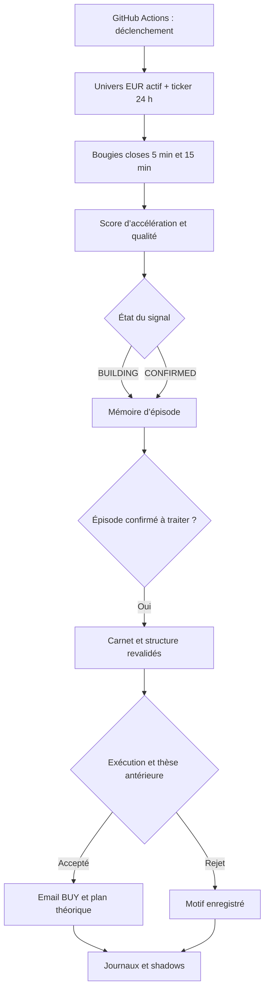

# Audit indépendant de Solaire V2 — Phase 1

**Conclusion : Solaire couvre réellement le marché et détecte beaucoup de mouvements. En revanche, sa chaîne « détection → entrée → évaluation » comporte des défauts d’architecture qui empêchent aujourd’hui de certifier son avantage économique. La priorité est de fiabiliser la mesure et la chronologie, puis de tester les mécanismes d’entrée. Changer seulement quelques seuils ne suffit pas.**

Version examinée : `9cc5a402aa7ac42da48a71dcde7096eedc25a768` du dépôt `Vadimrom-create/bitvavo-live`. Arrêt des observations : **22 septembre 2026, 21:45 UTC / 23:45 Paris**. Vérification finale du dossier effectuée le 23 septembre 2026, sans étendre la fenêtre historique. Les données et le code de production n’ont pas été modifiés. Aucune phase 2 n’a été engagée.

## Périmètre et méthode

- **206 cycles de production** retrouvés dans GitHub, du 20/09 à 19:27 au 22/09 à 21:43 UTC ; 204 runs Actions dans la collection consultée. Ces deux nombres comptent des objets différents : commits de statut et exécutions du workflow.
- **297 archives de marché**, dont une heure de marge initiale, et **327 472 bougies 5 min distinctes** ; aucun conflit entre les versions archivées d’une même bougie.
- Classements de **426 marchés présents aux deux extrémités**. Fenêtre « 24 h » effectivement couverte : 21/09 21:49:49 → 22/09 21:40:16 UTC. Fenêtre « 72 h » : 19/09 21:50:10 → 22/09 21:40:16 UTC. Les bornes suivent les snapshots disponibles ; ce ne sont pas les variations glissantes du ticker.
- **58 recommandations dans 56 livraisons** retrouvées ; plan entrée/stop/TP récupéré pour **55**. Trois anciennes recommandations n’ont pas de plan complet récupérable dans les artefacts examinés. Une livraison n’est ni la preuve de réception dans la boîte mail, ni celle d’un ordre exécuté.
- Le journal principal, créé plus tard, ne contient que **37 BUY et 481 rejets**, soit 518 lignes. Les rejets répétés ne sont pas des trades indépendants.
- **160 événements de rejet** dans le shadow dédié. Les tableaux de rejets reprennent ses observations en distinguant leur fiabilité de celle des replays recalculés ici.

La détection historique est prouvée par les payloads réellement enregistrés au moment considéré. Les bougies ultérieures servent uniquement à mesurer le résultat. Les archives du pipeline de recherche servent de source de prix et à tester des hypothèses ; elles ne sont jamais présentées comme les décisions du scan de production.

La production directe n’existait pas pendant les premières ~22 heures de la fenêtre de 72 heures. Ses règles ont ensuite changé : scan pur Solaire le 20/09, plafond de stop et mémoire de thèse dans la nuit, amplitude minimale de 6 % le 21/09 à 07:55, emails regroupant tous les candidats le 22/09 à 06:34 UTC. **Il n’existe donc pas ici une cohorte homogène de 72 heures sous les règles actuelles.** Étendre encore la fenêtre donnerait surtout davantage d’Old, pas davantage de preuves sur Solaire V2.

Les fichiers CSV joints constituent la table détaillée des observations. Les scripts de cet audit n’appellent ni le transport email, ni un exécuteur d’ordres.

## A. Architecture réelle



### Collecte et détection

`scripts/production_scan.py` interroge directement l’API publique Bitvavo. Les marchés EUR actifs sont tous parcourus, sans présélection V4. Deux séries de 100 bougies sont demandées par marché, avec huit threads et limitation de débit. Le dernier snapshot collecte **426/426 marchés**, en 72,6 secondes, sans erreur déclarée.

`research/features.py` élimine les bougies non closes à l’heure du signal, ordonne les bougies et représente les intervalles sans transactions par une bougie plate de volume nul. Les caractéristiques principales sont calculées sur 20 minutes en 5 min, et sur 15 min/1 h en 15 min.

`research/production_acceleration.py` additionne cinq composantes bornées entre 0 et 10 : momentum 5 min (30 %), accélération du momentum (25 %), expansion des volumes (20 %), pression de franchissement (15 %), composante 15 min (10 %).

- BUILDING : score ≥ 4,75 et au moins deux indicateurs dépassant leur seuil.
- CONFIRMED : score ≥ 6,50 et au moins trois indicateurs.
- **CONFIRMED ne signifie pas obligatoirement confirmation en 15 minutes.** Le code autorise `FAST_COMPOSITE_ONLY`. Les « preuves » sont des indicateurs en partie corrélés, pas des observations statistiquement indépendantes.
- Le contexte de marché est journalisé mais ne bloque pas les BUY. Le score n’est pas une probabilité de gain calibrée.

### Épisodes, entrée et réentrée

`research/production_alerts.py` suit BUILDING et CONFIRMED dans le même épisode. Une absence du marché dans le payload de suivi clôt l’épisode ; un retour en ouvre un autre. Un épisode déjà envoyé ou supprimé est considéré comme traité. Pas de délai global fixe entre deux marchés.

Le gate final, dans `scripts/send_production_buy_alert.py`, vérifie dans cet ordre : marché actif, volume 24 h ≥ 75 000 €, carnet cohérent, spread ≤ 0,5 %, structure 15 min valide et fraîche, amplitude des huit bougies 15 min ≥ 6 %, plan structurel valide, stop à moins de 10 %. Il vérifie ensuite la thèse du BUY précédent.

Le stop est `min(support 2 h − 0,5 ATR, entrée − 1,5 ATR)`. Le TP1 est placé à 2R et le TP2 à 3R, avec arrondi au tick. Le montant guide est plafonné à 250 € et le risque théorique à 12 €, coûts inclus. Le plan utilise 0,25 % de frais et 0,10 % de glissement **par côté**, et exige un ratio net ≥ 1,5.

**Ces plafonds sont individuels.** Le gate ne réserve pas de cash, ne plafonne pas le risque cumulé des recommandations simultanées et ne connaît pas le portefeuille réellement détenu.

Une thèse antérieure peut rester active pendant 24 h tant que le stop n’a pas été observé touché. Le TP atteint ou une vente réelle ne mettent pas cette thèse à jour. Les mèches de la bougie contenant l’alerte sont volontairement exclues faute d’ordre temporel précis.

### Sorties et mesures

Solaire envoie un plan de sortie ; **ce pipeline ne gère pas une position réelle ni ses ordres TP/SL**. Le « rendement réalisé » ci-dessous est donc un rendement simulé sous une convention explicite, pas le résultat du compte Bitvavo.

Après l’alerte, le workflow lance les shadows : candidats tous actionnables, BUILDING persistant, BUILDING de qualité, amplitude 5 %, liquidité émergente, reprise rapide, réévaluation des rejets, politiques de sortie. Ils n’interviennent pas dans les décisions stratégiques du gate. Ils consomment cependant du temps et des requêtes dans le même job ; le shadow « tous actionnables » passe même avant l’envoi du BUY.

## B. Ce qui fonctionne, avec preuves

1. **La couverture n’est plus limitée par V4.** Le code collecte l’univers EUR actif et le dernier état contient 426 marchés valides. Dans le top 30 des hausses sur 24 h, une trace BUILDING ou CONFIRMED existe pour **29 marchés sur 30**. Cela établit une capacité de détection, pas un taux de capture précoce ni de rentabilité.
2. **Les prix sont revalidés avant l’email.** L’entrée proposée utilise l’ask relu, pas simplement un ancien prix de signal. La dérive est mesurée. Aucune dépendance Oracle/Railway n’est nécessaire au chemin actuel du BUY.
3. **Certains rejets protègent d’issues défavorables.** À 4 h, les 13 événements du shadow initialement rejetés pour spread excessif ont six MAE ≤ −5 %, contre quatre MFE ≥ +5 %. Les deux groupes peuvent se recouper : une hausse temporaire n’est pas un trade gagnant.
4. **La séparation production/shadow est réelle dans le code.** Les variantes 1,4R/1,5R/1,6R ne remplacent pas le TP de production. Le T0 des sorties est explicite. C’est un bon principe ; sa mise en œuvre d’accumulation est toutefois défectueuse.
5. **Le système ne rejette pas mécaniquement toute accélération prolongée.** L’extension sert à ordonner les candidats, sans veto fixe de poursuite du prix. Les contrôles de structure demeurent séparés du détecteur.

## C. Ce qui échoue ou reste non démontré

### C1. Le journal peut inverser TP et stop — défaut certain

`research/production_journal.py`, fonction `evaluate_bars`, parcourt `raw_bars` sans tri et prend `bars[-1]` comme clôture. L’API Bitvavo fournit les bougies de la plus récente à la plus ancienne ([documentation officielle](https://docs.bitvavo.com/docs/rest-api/get-candlestick-data/)). `PublicClient` conserve cet ordre.

Le test de cet audit présente deux bougies : TP d’abord, stop ensuite. La fonction rend TP avec l’ordre croissant, STOP avec l’ordre API décroissant. MFE/MAE restent identiques, mais le rendement de clôture et l’ordre des événements changent.

**Cas réel : ZETA, BUY du 22/09 à 00:27 UTC.** Entrée 0,051019 €, stop 0,046926 €, TP 0,059205 €. La première bougie touchant le TP est celle de **03:10** ; la première touchant le stop est celle de **11:05**. Le journal à 12 h indique STOP. Le replay chronologique donne TP. Les observations à 4 h et 12 h doivent être cohérentes sur cette sortie irréversible.

Sur **67 comparaisons BUY × horizon** disposant d’une couverture complète dans nos archives, les 67 clôtures enregistrées diffèrent de notre clôture chronologique ; une classification TP/stop change. Le tri explique le défaut général ; les petites différences de borne temporelle ou de complétion expliquent éventuellement une partie des écarts de clôture. **Ce résultat ne signifie pas que 67 trades sont mal classés : il s’agit de 67 observations, avec plusieurs horizons par trade.**

Le shadow des politiques de sortie trie, lui, ses bougies. Il ne faut donc pas lui attribuer automatiquement cette erreur précise.

### C2. La cohorte prospective n’est pas cumulative — défaut certain

`scripts/update_exit_policy_shadow.py` filtre les BUY sur `LOOKBACK = 30 h`, puis réécrit le journal avec cette seule liste. Un trade sort des compteurs même s’il appartient au T0 gelé. Les objectifs « 30 observations à 4 h » et « 50 à 12 h » sont en pratique des objectifs dans des fenêtres mobiles, pas des accumulations depuis T0.

Pour conserver 50 trades âgés d’au moins 12 h et d’au plus 30 h, il faut 50 nouvelles recommandations dans une fenêtre de 18 h. Attendre plus longtemps ne garantit donc pas l’atteinte du checkpoint. Le test reproduit la disparition d’un membre entre 29 et 31 heures.

Au gel examiné, le T0 est le **22/09 à 18:54:05 UTC** : trois BUY prospectifs, aucun encore complet à 4 h. Aucune conclusion prospective de supériorité d’un TP n’est disponible.

### C3. « Horizon complet » ne garantit pas l’historique complet — défaut certain

Le shadow utilise seulement la proximité de la dernière bougie avec la fin de l’horizon. Il ne vérifie pas la présence du début. Une unique bougie située à la fin de 4 h est marquée complète dans notre reproduction.

Les appels demandent les 400 dernières bougies sans bornes explicites. Une réévaluation tardive peut donc perdre le début d’un trade actif tout en restant « complète ». Les intervalles sans trades sont légitimes ; un nombre de bougies faible ne suffit pas à prouver une perte de données. Il faut conserver la fenêtre source et contrôler sa couverture, pas imposer naïvement 48 transactions en 4 h.

Le marqueur de complétude peut aussi devenir vrai **avant la maturité de l’horizon** : un test supplémentaire obtient « complet » à 3 h 55 pour un horizon de 4 h. Cette tolérance vient du seuil de fin moins 600 secondes, sans contrôle séparé de maturité dans `_sim`. Le nombre de cas historiques effectivement touchés n’est pas établi.

Le journal principal et le simulateur de sortie acceptent aussi une bougie dont le début est avant la fin de l’horizon mais dont la clôture est après. Notre reproduction montre l’inclusion de données jusqu’à quatre minutes au-delà de l’horizon demandé.

### C4. La cadence effective est très inférieure à la cadence annoncée

Sur les dernières 24 h : **83 runs programmés**, contre 288 créneaux théoriques d’un cron toutes les cinq minutes. Intervalle médian entre créations de runs programmés : **17,23 min**, maximum **27,35 min**. Durée médiane de ces jobs : **2,12 min**. En incluant les déclenchements manuels/par modification, 94 cycles de production, intervalle médian **16,39 min**.

La limitation principale mesurée n’est donc pas la collecte de 73 secondes, mais l’intervalle entre les exécutions observées. Le lien causal avec chaque opportunité manquée reste à mesurer. Aucune preuve ne permet de promettre qu’un cron de cinq minutes donne une observation toutes les cinq minutes.

### C5. Réentrée et exécution : contrôles incomplets

- Un épisode supprimé pour thèse antérieure active est marqué définitivement traité. Si le stop de cette thèse est ensuite touché **sans changement d’épisode**, le sélecteur ne représente plus le candidat au contrôle de thèse. Reproduction comportementale jointe ; pertes réelles causées par ce cas non quantifiées.
- Le carnet demandé contient 25 niveaux, mais le gate de production ne conserve que le meilleur bid et le meilleur ask. **Il ne simule pas l’absorption du montant guide dans la profondeur.** Volume journalier et spread ne démontrent pas à eux seuls l’exécution possible de 250 €.
- Le traitement des candidats partage un bloc d’exception extérieur à la boucle : l’erreur technique d’un candidat peut interrompre la sélection de tout le lot. Possibilité démontrable par lecture du chemin d’exécution, pas incident attribué dans cet audit.
- Le shadow des rejets déclare parfois la condition initiale « résolue » dès que le motif change. Or passer de « range trop faible » à « spread trop large » ne prouve pas que le range s’est amélioré : le test de spread intervient avant celui de range.
- Les 518 lignes du journal ont `signal_phase` et `episode_extension_pct` à `null`. La mémoire enrichie existe dans la couche email, mais le journal lit des champs absents du payload initial. La maturité de l’épisode n’est donc pas auditable depuis ce journal seul.

## D. Faux négatifs, par cause

Les deux CSV `winners_24h.csv` et `winners_72h.csv` donnent pour chaque top 30 : prix de départ et d’arrivée, première trace de détection, état, premier BUY, rejets, prix d’entrée disponible, horodatages et commit source. « Avant +5/+10/+20 % » y est défini par rapport au début de la fenêtre, **pas par rapport à un début de pump choisi après coup**. Les franchissements observés sont ceux des snapshots ; l’heure exacte entre deux snapshots reste inconnue.

| Cas | Hausse sur ~24 h | Chronologie observée | Diagnostic défendable |
|---|---:|---|---|
| DRIFT | +35,81 % | BUY déjà enregistré le 20/09 puis le 21/09 ; pas de nouveau BUY dans cette fenêtre | Ce n’est pas un actif « jamais vu ». Impossible d’attribuer une sortie réelle trop précoce sans les ordres du compte. |
| CHR | +32,11 % | BUILDING à +2,48 % de la base ; liquidité, puis spread, puis stop large | Détection présente ; problème d’accès à une entrée validée. Pas de preuve que le carnet permettait un meilleur achat. |
| KERNEL | +27,88 % | CONFIRMED à +1,35 % ; BUY à +41,62 %, avant reflux | Détection précoce, entrée nettement plus tardive. La durée traverse plusieurs états/épisodes ; ce n’est pas une simple file d’attente continue. |
| BCH | +27,44 % | BUILDING tôt ; range rejeté à 244,20 €, stop rejeté à 262,80 € seize minutes après | Cas documenté d’incompatibilité successive des gates. |
| PENGU | +17,14 % | BUILDING à +1,84 % ; deux rejets de range, aucun BUY | Détection suivie de rejets structurels. Rentabilité d’une entrée alternative non démontrée. |
| ZRO | +15,19 % | Range rejeté à 1,082 €, stop large à 1,1994 € | Même mécanisme possible, avec délai de plusieurs heures. |
| FLUX | +12,20 % | CONFIRMED, rejets pour liquidité | Faux négatif potentiel lié à l’exécution ; ne justifie pas la suppression du filtre. |
| ZBT | +9,39 % | Aucune trace de détection dans les 24 h couvertes | Absence de trace documentée, pas preuve de rentabilité accessible. |

Dans le top 30 à 24 h : 15 marchés détectés/rejetés sans BUY dans la fenêtre, 10 avec BUY ultérieur, quatre détectés sans motif final suffisant pour expliquer toute la trajectoire, un sans trace. Certains avaient un BUY avant la fenêtre : ces catégories ne sont pas un décompte de « 20 opportunités ratées ».

À 72 h, les cas ICX (+68,57 %) et ZRC (+50,65 %) ont des confirmations enregistrées puis des rejets de liquidité/spread. Les phases antérieures au lancement du scanner ne sont pas imputées à Solaire. Le dossier détaillé conserve cette censure plutôt que de fabriquer une détection hypothétique.

### Présentation séparée des cinq catégories demandées

Ces catégories peuvent décrire des épisodes différents d’un même actif. Un marché apparaissant dans le classement ne représente pas nécessairement un trade unique.

| Catégorie | Cas documentés | Ce qui est démontré | Ce qui ne l’est pas |
|---|---|---|---|
| Gagnants correctement détectés puis recommandés | TREAD : BUY du 21/09 10:04 UTC ; ZETA : BUY du 22/09 00:27 UTC | Leur plan documenté atteint le TP avant le stop dans les bougies conservées après la décision, en moins de 4 h. Rendements nets simulés : respectivement +9,37 % et +15,24 %. | L’exécution réelle sur le compte, les premières minutes exclues et le meilleur prix d’entrée possible. |
| Gagnants détectés mais rejetés | BCH, CHR, PENGU, ICX, ZRC | Présence d’un signal et motifs de refus enregistrés avant une partie de la hausse ultérieure. | Qu’accepter le candidat aurait amélioré l’espérance nette après profondeur, frais et pertes supplémentaires. |
| Mouvements non détectés aux scans archivés | ZBT dans la fenêtre ~24 h | Aucun export BUILDING/CONFIRMED retrouvé dans les payloads de production de cette fenêtre, malgré +9,39 % entre bornes. | L’absence de signal entre deux scans ; le rôle exact d’une qualité de données invalide ; l’exécutabilité de la hausse. Aucune conclusion générale « Solaire ne voit jamais ZBT ». |
| Faux positifs et rejets protecteurs | Faux positifs : COTI, LAPTOP du 22/09 11:20. Protection observée contre des trajectoires défavorables : BONK/BOME/AVA dans le test de range 5 %. | Stops après BUY dans les deux premiers cas ; les candidats supplémentaires des trois derniers présentent des issues défavorables à 4 h dans le shadow. | La rentabilité globale du filtre ; une clôture négative n’implique pas forcément un trade perdant avec une autre sortie. |
| Problèmes de conservation des gains | PROVE, CELR, GRASS ; comparaison 2R contre les TP plus proches | Excursions favorables documentées puis restitution d’une partie ou de tout le gain sous le plan initial. | Une supériorité prospective stable de 1,4R, 1,5R ou 1,6R. |

DRIFT est traité séparément : il avait déjà fait l’objet de recommandations avant la fenêtre de 24 h. Sans historique des ordres réellement exécutés, cet audit ne le classe pas en « sortie réelle trop précoce ».

### Test de la zone « trop calme, puis trop volatile »

Sur 803 observations où le détecteur actuel, rejoué sur les caractéristiques archivées, classe le marché CONFIRMED : 432 ont un range < 6 %, 195 un range suffisant mais un stop > 10 %, 176 passent ces deux seules contraintes. **Ce sont des observations répétées et une approximation historique du gate, pas 803 trades exécutables.**

Douze transitions de range insuffisant à stop excessif apparaissent à moins d’une heure d’intervalle dans ce proxy. Certains cas précèdent l’introduction du seuil 6 % et sont uniquement contrefactuels. Les statuts **réels** de BCH le 22/09 prouvent cependant que le mécanisme peut se produire en production. Cela ne prouve ni qu’un achat plus tôt aurait été rentable, ni qu’il n’existait aucune fenêtre intermédiaire entre deux scans.

## E. Faux positifs et coût des assouplissements

Le replay principal retient les BUY postérieurs à l’introduction du gate de range, avec plan documenté et toutes les bougies de la grille après la bougie d’alerte jusqu’à l’horizon. À 4 h, **35 observations complètes** : 11 rendements nets positifs sous la politique TP1/stop, quatre stops, deux TP ; les autres sont valorisées à l’horizon. Une valorisation négative à 4 h n’est pas nécessairement une perte finale du trade.

| Exemple | MFE 4 h | MAE 4 h | Résultat net simulé 4 h | Cause observable |
|---|---:|---:|---:|---|
| LAPTOP, BUY du 22/09 11:20 UTC | +0,57 % | −9,57 % | −6,51 %, stop | Accélération qui ne poursuit pas après l’entrée. |
| COTI | +0,62 % | −5,36 % | −5,31 %, stop | Très peu d’upside post-entrée. |
| KERNEL | +0,81 % | −5,93 % | −4,17 %, valorisation | Entrée tardive au sein du mouvement observé. |
| PROVE | +14,62 % | −7,02 % | −7,67 %, valorisation | Forte excursion favorable non conservée par le TP initial. |
| CELR | +9,87 % | −10,48 % | −6,42 %, stop | Hausse temporaire puis invalidation. |

Ces chiffres utilisent 0,35 % par côté, incluant le glissement conventionnel ; ils ne sont pas les frais ni les transactions réellement constatés sur le compte.

Les shadows existants fournissent une comparaison symétrique utile, encore exploratoire :

| Variante observée | Fenêtres supplémentaires | Observations à 4 h | MFE ≥ 5 % | TP touché | Stop touché | Clôtures positives / négatives |
|---|---:|---:|---:|---:|---:|---:|
| Range 5 % accepté, range 6 % refusé | 16 | 15 | 7 | 4 | 1 | 6 / 9 |
| BUILDING de qualité passant le gate d’exécution | 7 | 6 | 3 | 3 | 1 | 3 / 3 |

Source : journaux des shadows, extraction `relaxation_shadows.json`. Ces fenêtres peuvent se répéter sur un même actif ou recouper une thèse antérieure. Elles ne sont donc pas 16 ou sept nouveaux BUY indépendants. Les indicateurs de TP/stop touché ne remplacent pas un replay complet de portefeuille. **Abaisser le range aurait admis AIOZ/ZRO, mais aussi des cas défavorables comme BONK/BOME/AVA.** Le compromis doit être mesuré prospectivement à règles fixes.

Sur les 35 BUY complets à 4 h, les classes de score 6,5–7,49 / 7,5–8,49 / 8,5–10 présentent respectivement **2/10, 6/11 et 3/14** résultats nets positifs. Aucun ordre monotone ne se dégage. C’est une raison de ne pas lire « 9/10 » comme une forte probabilité de profit ; ce n’est pas une justification pour optimiser maintenant un nouveau seuil de score.

## F. Entrées et réentrées

Les rejets d’exécution ordinaires ne marquent pas l’épisode comme envoyé : un CONFIRMED persistant est réévalué au scan suivant. Mais trois discontinuités subsistent : cadence effective ~17 min, perte de confirmation pendant l’amélioration de l’exécution, suppression définitive d’un épisode pour thèse antérieure.

Dans les 160 événements du shadow des rejets : **38** ont une observation ultérieure où le gate d’exécution passe, dont **23** une observation CONFIRMED passant ce gate. Le délai médian jusqu’à la première observation d’exécution valide est **171,24 min** ; variation médiane du prix depuis le rejet **+1,70 %**. Ce délai ne mesure pas l’instant exact de disparition de la contrainte, uniquement sa première observation. Le shadow ne vérifie pas intégralement l’éligibilité finale liée à la thèse précédente : « pleinement actionnable » dans ce journal n’équivaut pas automatiquement à « email aurait dû être envoyé ».

`reentries.csv` fournit les trajectoires et rapprochements avec les BUY suivants. Sans surveillance continue du carnet, l’upside perdu pendant l’intervalle doit rester une borne observée, pas une mesure exacte.

## G. Sorties : résultat capté et potentiel

Méthode indépendante : bougies ordonnées, arrêt aux données closes avant la fin de l’horizon, exclusion de la bougie contenant l’alerte, stop prioritaire si stop et TP sont touchés dans la même bougie, entrée au prix documenté. Les trajectoires doivent disposer de **100 % des intervalles archivés** attendus après la première bougie pleine. Les bougies synthétiques sans trades sont conservées comme telles. Les résultats non arrivés à maturité restent exclus des agrégats.

Le résultat à l’horizon est une valorisation/fermeture hypothétique si aucun TP ou stop n’a été touché. L’exclusion des premières minutes crée une incertitude commune à toutes les politiques. Les exécutions réelles, le glissement d’un stop au-delà du niveau et l’absorption des ordres ne sont pas connus.

| Horizon | N, même cohorte par ligne | TP 2R actuel : moyenne nette | TP 1,4R | TP 1,5R | TP 1,6R |
|---|---:|---:|---:|---:|---:|
| 4 h | 35 | −0,500 % | +0,781 % | +0,715 % | +0,874 % |
| 12 h | 24 | −0,575 % | +0,609 % | +0,456 % | +0,604 % |
| 24 h | 14 | −1,839 % | +0,115 % | +0,339 % | +0,563 % |

Coût identique de 0,35 % par côté ; le rendement net tient compte du prix de sortie. Le R brut et le R net sont séparés dans `buy_outcomes.csv`. Ce fichier contient aussi MFE, MAE, délai au sommet, motif de sortie et fraction d’upside positif captée. Les lignes antérieures au gate 6 % y sont conservées mais marquées séparément ; elles ne sont pas incluses dans le tableau principal.

**Lecture :** des TP plus proches méritent un test, mais aucun des trois ne gagne à tous les horizons. Le choix 1,4/1,5/1,6R a déjà été inspiré par l’historique ; les chiffres ci-dessus sont encore rétrospectifs, même si les BUY ont été enregistrés avant leur résultat. Les cohortes de 4/12/24 h n’ont pas les mêmes membres et ne doivent pas être comparées comme une courbe temporelle d’un portefeuille.

L’audit ne démontre pas que tous les stops sont mal placés. Il documente surtout des entrées tardives, des excursions favorables rendues au marché et une politique 2R mécanique dont la probabilité d’atteinte n’est pas calibrée. Un déplacement généralisé du stop serait aussi une modification stratégique à tester séparément.

## H. Risques méthodologiques et conclusions falsifiables

| Conclusion | Preuve et N | Explication alternative / limite | Ce qui la réfuterait ou en réduirait la portée |
|---|---|---|---|
| L’évaluation principale n’est pas chronologique | Reproduction ; ZETA réel ; 67 observations vérifiées | Bornes légèrement différentes pour certaines clôtures | Un tri effectif avant cet appel ; absent du chemin actuel. Refaire les métriques avec les réponses brutes exactes permettrait d’isoler tous les écarts. |
| La cohorte de sortie perd ses anciens membres | Filtre 30 h et remplacement du journal ; test 29→31 h | Une forte fréquence de BUY pourrait quand même atteindre ponctuellement les seuils | Un accumulateur externe immuable utilisé par la décision ; aucun trouvé dans ce chemin. |
| La cadence gêne potentiellement la précocité | 83 runs programmés/24 h, médiane 17,23 min | Des accélérations lentes peuvent rester captables | Mesurer un recall identique entre observations à cinq et dix-sept minutes sur des données contemporaines conservées. |
| Le couplage range/stop crée des fenêtres manquées | BCH réel ; douze transitions proxy | Un rejet peut éviter une perte ; les quotes proxy ne sont pas le carnet exact du gate | Un replay avec carnets horodatés montrant que toutes les entrées supplémentaires sont inexécutables ou dégradent l’espérance nette. |
| Un TP plus proche mérite une étude | 35/24/14 BUY complets, mêmes entrées | Concentration sur quelques mouvements, corrélation des actifs, sélection a posteriori | Cohorte prospective cumulative donnant un avantage nul ou négatif après coûts et contrôle des régimes. |
| Un score plus élevé n’est pas une probabilité calibrée | 10/11/14 BUY dans trois classes | Échantillon petit, régime et timing confondus | Calibration prospective monotone et stable avec intervalles d’incertitude. |

Autres limites :

- La cohorte de 72 h mélange plusieurs versions ; l’ancienne documentation ou les conclusions d’autres audits n’ont pas été utilisées comme preuve de l’avantage de Solaire.
- Le classement des gagnants est rétrospectif par construction. Il sert à enquêter sur une chronologie, pas à optimiser les seuils sur ces noms.
- Les bougies 5 min ne déterminent pas l’ordre des événements intrabar. Les premières minutes après l’email restent inconnues avec cette granularité.
- Les rejets mesurés au dernier prix ne sont pas tous exécutables à ce prix. Leur MFE n’est pas un gain disponible garanti.
- La grille de marchés aux deux bornes exclut les nouveaux marchés/disparitions : léger biais de survivant possible. L’inventaire exact des cotations doit accompagner une comparaison future.
- La valeur « toutes les données valides » provient aussi d’un comblement des intervalles sans trades. Une réponse tronquée techniquement peut être confondue avec l’absence de transactions ; reproduction jointe. Aucun incident réel de cette nature n’est attribué ici.
- Les conditions de gate ne sont pas toutes persistées lors d’un rejet, et les payloads ne conservent que les marchés détectés. On peut vérifier ce qui a été exporté, mais pas reconstruire exactement tous les non-signaux du scanner à chaque cycle.
- Les sommes de gains simulés aux montants guides ne représentent pas un portefeuille finançable : ni réservation du capital, ni risque corrélé global, ni ordres réellement exécutés ne sont reconstruits.
- Un workflow vert n’est pas une preuve d’email envoyé : six statuts `SMTP_AUTHENTICATION_ERROR` figurent au début de la période. Aucun n’apparaît dans les derniers cycles examinés.

### Statut exact des statistiques historiques

| Statistique / source | Statut | Usage autorisé et travail restant |
|---|---|---|
| Horaires des commits, des runs, statuts de livraison, motifs de rejet | **Faits documentés** dans les sources figées | Comptages et cadence vérifiables. Un statut de livraison ne prouve ni réception dans Gmail ni achat effectif. |
| Classements 24/72 h, prix des snapshots et premières traces de détection exportées | **Fiables comme descriptions de l’archive** | Conserver les bornes exactes et la censure avant le lancement. Ne pas transformer le top 30 en performance d’une stratégie sélectionnée à l’avance. |
| Clôtures et ordre TP/stop du journal principal | **Contaminés par le défaut de tri** | Recalcul de toutes les clôtures et sorties de ce chemin, puis des agrégats qui en dépendent. Le contrôle de 67 observations prouve un défaut ; il ne certifie pas les autres lignes. |
| MFE/MAE du même journal | **Invariants au tri seul, mais pas certifiés globalement** | Le tri seul ne change pas max/min. Recontrôler début/fin, bougies closes, couverture et prix de référence avant de conserver ces valeurs. |
| Rendements et R des anciens audits de sortie / shadows | **Le tri y est correct ; couverture et maturité à revalider** | Ne pas les rejeter pour le mauvais motif. Recalculer les cohortes dont le début peut être tronqué ou la fin anticipée, et harmoniser frais/glissement. Le `r_multiple` existant est brut, pas un R net après coûts. |
| Compteurs prospectifs 30/50 et comparaisons depuis T0 | **Ne représentent pas une accumulation cumulative valide** | Reconstruire les membres immuables depuis T0, conserver les résultats maturés, puis recalculer les comparaisons. Ne pas déduire une date d’atteinte par simple attente. |
| « Condition initiale résolue », « pleinement actionnable » dans le shadow des rejets | **Sémantique insuffisante** | Revoir la condition elle-même et tous les gates, y compris la thèse antérieure. Les 58 conditions marquées résolues ne sont pas 58 preuves de disparition de la contrainte initiale. |
| Résultats de `buy_outcomes.csv` de cet audit | **Recalculés, cohérents et descriptifs sous hypothèses explicites** | Le tableau principal utilise 35/24/14 observations avec grille archivistique complète après la première bougie pleine. Il reste un replay rétrospectif sans preuve de remplissage, sans les premières minutes, ni risque portefeuille. |
| Statistiques des assouplissements range/BUILDING citées ici | **Exploratoires, extraites des shadows** | Pas toutes recalculées indépendamment depuis les réponses brutes exactes. Revalider couverture et déduplication avant promotion d’une variante. |
| Avantage futur, portefeuille finançable, rendement réel du compte | **Non établis** | Aucun taux de réussite global, espérance future ou rendement de compte certifié ne doit être déduit de cet audit. |

Les horodatages de décision utilisés par les journaux sont ceux du contrôle du statut (`checked_at_utc`), pas les horodatages d’exécution d’ordres. La validation et l’envoi peuvent se produire quelques secondes plus tard. Une frontière de bougie traversée pendant ce délai constitue une incertitude supplémentaire. Le CSV conserve les `actual_mark_sent_ts` retrouvés dans les anciens états, sans les substituer silencieusement aux conventions des autres lignes.

Le montant total en euros dans les sorties brutes de l’audit n’est calculable que pour les montants guides retrouvés : **34/35 à 4 h, 23/24 à 12 h et 13/14 à 24 h** dans la cohorte principale. La moyenne en pourcentage utilise tous les plans ; les sommes en euros ne doivent pas être comparées comme si elles portaient sur un compte réel ou sur la totalité des mêmes membres.

### Défauts certains, observations stratégiques et hypothèses

- **Certains dans le code ou la mesure :** absence de tri du journal principal, contrôles de couverture/maturité insuffisants, éviction à 30 h de la cohorte, suppression d’un épisode empêchant une réévaluation ultérieure, absence de contrôle de profondeur pour le montant guide, champs de maturité non propagés au journal. La cadence ~17 min est un fait opérationnel mesuré, pas un bug algorithmique attribué sans preuve.
- **Démontrés sur des cas, sans généralisation statistique :** enchaînement de rejets incompatibles range/stop sur BCH ; entrée tardive sur KERNEL ; gains favorables non conservés sur plusieurs BUY ; certains filtres écartent aussi des trajectoires défavorables.
- **Hypothèses à tester :** rendement supplémentaire obtenu avec des scans réellement toutes les cinq minutes ; supériorité d’un seuil 5 % ; bénéfice d’une nouvelle mémoire de réentrée ; meilleur TP parmi 1,4/1,5/1,6R ; surperformance future de Solaire. Leur mécanisme est plausible, mais leur avantage économique n’est pas démontré.

## I. Les cinq problèmes à plus fort impact potentiel

| Priorité | Problème | Effet | Travail à préparer avant toute promotion |
|---|---|---|---|
| 1 | Chronologie et couverture des évaluations non fiables | Peut inverser la conclusion d’un trade et contaminer les décisions de réglage | Un évaluateur commun trié, borné, avec provenance et censure explicite ; recalcul isolé des résultats historiques. |
| 2 | Cohorte prospective mobile au lieu de cumulative | Le checkpoint peut ne jamais s’accumuler comme prévu ; sélection des survivants récents | Journal immuable depuis T0, fenêtres de sortie figées, versions/hypothèses hashées et résultats clôturés conservés. |
| 3 | Cadence effective ~17 min sur une stratégie d’accélération | Une fenêtre courte peut naître et disparaître entre deux scans | Mesurer les délais et les fenêtres manquées ; tester une cadence effectivement tenue dans les contraintes d’infrastructure autorisées. |
| 4 | Couplage détection/structure/réentrée discontinu | Détecté tôt ne devient pas nécessairement achetable au bon moment | Expériences séparées sur mémoire de setup, réévaluation et range/stop ; mesurer simultanément les trades supplémentaires gagnants et perdants. |
| 5 | Chaîne d’exécution et de sortie insuffisamment validée | Un ratio 2R théorique et un faible spread peuvent donner une fausse impression d’avantage exploitable | Profondeur pour un montant identique, modèle de remplissage, frais/glissement communs, séparation R net/brut et comparaison prospective des sorties. |

Les deux premières actions relèvent d’abord de la fiabilité de la mesure. Les trois suivantes touchent au comportement opérationnel ou stratégique et doivent rester des propositions/shadows jusqu’à décision explicite. **Aucune de ces corrections n’est déployée par cet audit.**

## J. Conclusion et arrêt de phase

**Le premier obstacle certain est la fiabilité de la mesure. Des limites plus profondes d’architecture existent aussi ; leur poids économique relatif n’est pas encore quantifié.** La couverture de marché et la séparation détection/exécution sont de bonnes bases. Mais la cadence effective, la mémoire de réentrée, la validation de profondeur et l’accumulation des résultats présentent des limites que quelques ajustements de seuils ne résolvent pas. Les cas BCH/KERNEL et les replays de sortie donnent des indices concrets de difficultés stratégiques, sans établir combien de rendement chaque mécanisme fait perdre.

Il serait donc excessif d’affirmer « ce sont principalement les seuils », « tous les mauvais résultats viennent des bugs de mesure » ou « toute l’architecture est mauvaise ». **Diagnostic retenu : mesure défectueuse certaine ; limites opérationnelles et de conception documentées ; hiérarchie des causes de sous-performance encore non démontrée.**

Je ne recommande ni de déclarer Solaire supérieur, ni de l’abandonner à partir de ces quelques journées. Je recommande de rendre les preuves fiables avant de décider quoi conserver ou remplacer. L’audit identifie des changements techniques préparables et des hypothèses stratégiques testables, sans choisir opportunément un seuil sur les derniers gagnants.

**Phase 1 terminée sur les sources accessibles, avec limites explicites sur les premières heures, les exécutions réelles et les carnets historiques. Arrêt ici. Aucun challenger Astra n’a été conçu ou déployé.**

## Reproduction et pièces

Depuis un checkout de la version source indiquée, avec les fichiers d’audit ajoutés :

```bash
python audit/astra_20260922/acquire_runtime.py
python audit/astra_20260922/acquire_early_plans.py
python audit/astra_20260922/build_dataset.py
python audit/astra_20260922/reproduce_defects.py
python audit/astra_20260922/analyze.py
python audit/astra_20260922/verify_final.py
```

Les deux premières commandes téléchargent uniquement les versions GitHub dont les SHA sont figés dans le manifeste. Les quatre suivantes sont hors ligne. Aucune commande ne doit lancer le workflow de production ni le script d’envoi de BUY.

- `results.json` : résultats agrégés et trajectoires des gagnants.
- `winners_24h.csv`, `winners_72h.csv` : top 30 documentés séparément.
- `reconstructed_buys.csv` : inventaire des 58 recommandations et provenance des plans.
- `buy_outcomes.csv` : replays des plans documentés, maturité et couverture explicites.
- `journal_verification.csv` : rapprochement journal/replay.
- `reentries.csv` : événements et observations de réentrée.
- `range_stop_transitions_research_proxy.csv` : test de géométrie historique, distinct des statuts de production.
- `defect_reproductions.json` et `reproduce_defects.py` : six reproductions comportementales.
- `verify_final.py` et `final_verification.json` : douze vérifications arithmétiques de cohortes, contrôle de 67 observations du journal, cadence recalculée et reproduction supplémentaire d’un horizon déclaré complet cinq minutes trop tôt.
- `runtime_commits.json`, `archive_manifest.json`, `workflow_runs.json`, `*_code_commits.json` : provenance et changements de versions.
- `relaxation_shadows.json` : extraction des variantes range/confirmation, avec leurs issues favorables et défavorables.

Les volumineux fichiers dérivés et les caches de téléchargement sont reproductibles et exclus du commit ; les sources originales restent identifiées par le commit gelé et les manifestes.

